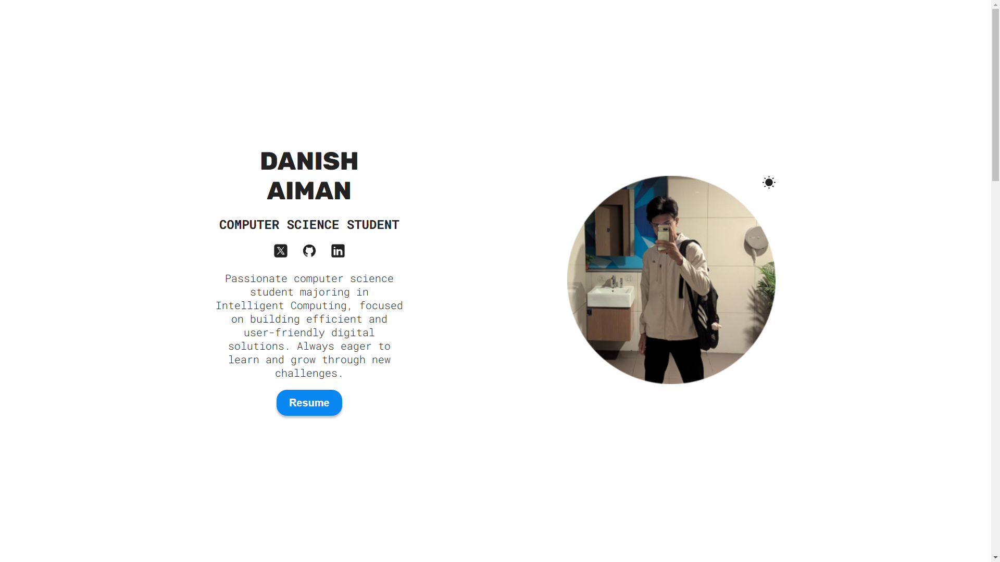

# 🚀 Personal Portfolio

Welcome to my **React Portfolio**! This project showcases my work, skills, and experience in a visually appealing and user-friendly way.

## 📝 Overview
This portfolio is built with **React.js**, styled with modern CSS libraries, and optimized for responsiveness across all devices.

## 📸 Preview


## 🛠️ Tech Stack
- **Frontend:** React.js
- **Styling:** CSS
- **Deployment:** Netlify

## 📂 Project Structure
```
├── public
├── src
│   ├── assets
│   ├── common
│   │   ├── ProjectCard.jsx
│   │   ├── SkillList.jsx
│   │   ├── ThemeContext.jsx
│   ├── component
│   ├── App.css
│   ├── App.jsx
│   ├── index.css
│   ├── main.jsx
├── .gitignore
├── eslint.config.js
├── index.html
├── package.json
├── package-lock.json
├── README.md
└── vite.config.js
```

## 🚀 Deployment
This project is deployed on **Netlify**. You can view it live here:
👉 [Live Demo](https://danishaiman.com)

## 🤝 Contributing
Contributions are welcome! If you find bugs or have suggestions, feel free to open an issue or submit a pull request.

## 📬 Contact
- **Email:** danishaiman@student.usm.my
- **LinkedIn:** [danishayman](https://www.linkedin.com/in/danishayman/)


---
Made with ❤️ using **React.js**.

Enjoy exploring my portfolio! 😊

---
